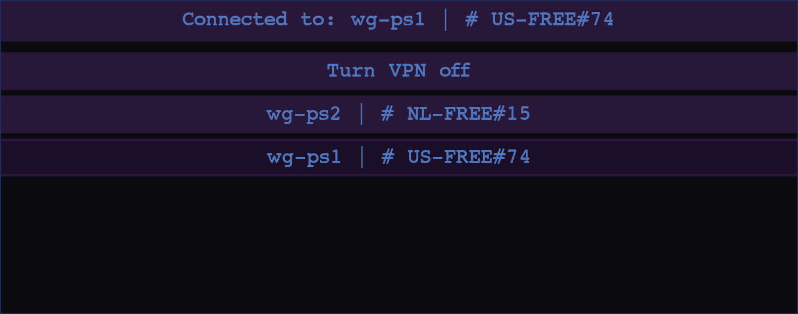
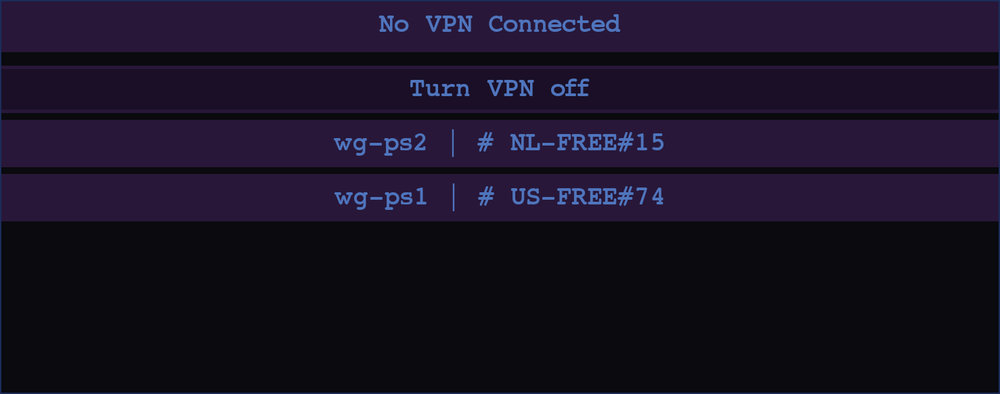
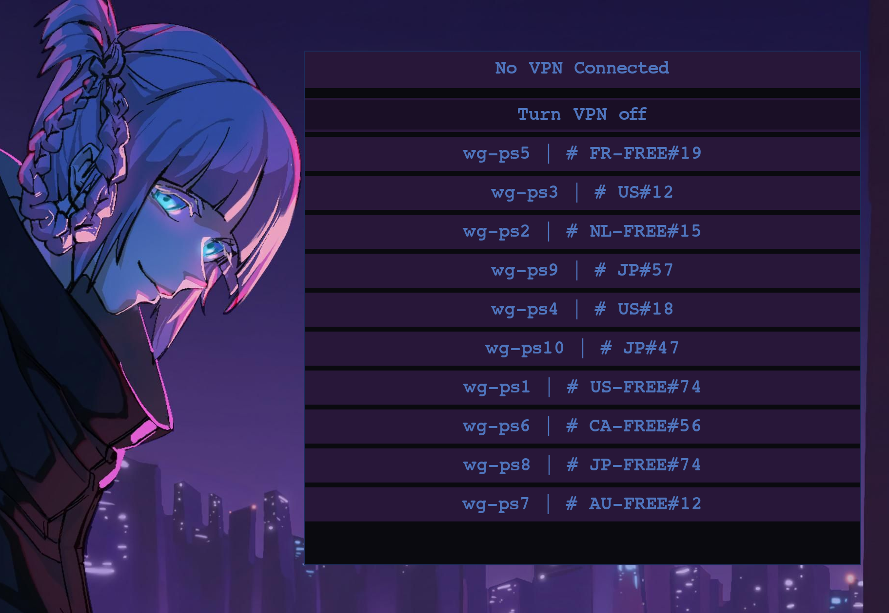

<h1 align='center'> Gooey Plate </h1>
<h2 align='center'> A customizable GUI front end for wireguard </h2>

<p align='center'>
    
</p>

<p align='center'>
    
</p>


## About

Gooey Plate is a graphical front end for wireguard using primarily the `wg-quick` commands. Making it easy to have many VPN severs saved without the need to write them down or memorize them, and then to switch between them with nothing but the click of a button and perhaps in the future, the tap of a key. 

I made this as a simple one function program to do the same function as something like the proton VPN GUI app just with more graphical customizability and using wireguard as the backend so you are not limited to one VPN providor. Plus, it wasn't really available on my distro easily, and I figured it was easier to make my own. Although wg-easy might be a bit better to be fair, I just like making my own stuff.


<p align='center'>

</p>

## Requirements
#### Running the Linux executable:
- wireguard
- bash

#### If compiling yourself or just running with raw python:
- wireguard
- bash
- python
- pygame-ce `regular pygame would probably be fine as well`

<br>


## Installation

<div style="color: red; font-weight: bold;">

## **DISCLAIMER: DO NOT PROCEED IF YOU DO NOT UNDERSTAND THE RISKS**

</div>

For this next step be aware that you are in fact poking a hole in the security of your system. By removing the sudo requirement from these commands, `wg-quick up`, `wg-quick down`. Your system will now be vunerable to any attack that leverages these tools. 

I personally am not aware of how these could be exploited, but there is always a possibility. And of course there is no guarantee that there will be a patch implemented by the maintainers of wireguard or the linux kernal if a vulnerability is ever found. 

Do your own research, don't just take my word for it.

Ye have been warned. Continue at your own risk.

---

<br>

Once the [requirements above](#Requirements) are met, you'll need to remove the sudo requirement for specifically the `wg-quick up` and `wg-quick down` by adding a rule into your `/etc/sudoers.d/` directory. 

To make sure your permissions don't get overwritten by something like, `wheel` you need to name it something like this `zz-wg-quick`. Inside write,

``` bash
#replace $USER with your users name
$USER ALL=(ALL) NOPASSWD: /usr/bin/wg-quick up *, /usr/bin/wg-quick down *
```
If you do not have a `/etc/sudoers.d/` directory, you can achieve the same thing by putting the line above within your `/etc/sudoers` file; just make sure it is written at the very bottom of the file.

Save the changes and finally change the permissions of this file to 640. Unless you did this in `/etc/sudoers` in which case you don't need to do this, for it should already be secured.

``` bash
chmod 640 zz-wg-quick
```

Make sure you have some `vpn.conf` files or whatever you want to name them inside of `/etc/wireguard/`.

<br>

#### Linux executable:

Once the [requirements above](#Requirements) are met, download the release named `gooeyplate.tar.gz`.

Unpack the `tar.gz` and run the `gp-update-database` which is included in the `tar.gz` as sudo.

This will make copies of those files in `/etc/wireguard/` without all the sensitive information like your private keys.

Those copies will be in `~/.config/gooeyplate/vpns/` to be used by gooeyplate so it knows the names of the config files.

Once that is done you can run `./gooeyplate`.

Once done, you can [configure](#Configuration) to your heart's content.

<br>

#### Running raw with python:
Download the source code with,
```bash
git clone https://github.com/Aslo222/gooey-plate.git
```

Make sure you have done the [preliminary things above,](#Installation) then install the requirements,
```bash
# use your favorite package manager
pipewire wireguard python

python -m pip install pygame-ce # or just pygame
```

--- 

Then you run the `gp-update-database` which is included with the source code, as sudo.

This will make copies of those files in `/etc/wireguard/` without all the sensitive information like your private keys.

Those copies will be in `~/.config/gooeyplate/vpns/` to be used by gooeyplate so it knows the names of the config files.


You can now run the `gooeyplate.py` file with python,
```bash 
python gooeyplate.py
```

Once done, you can [configure](#Configuration) to your heart's content.

If you want to build it yourself you can use something like [pyinstaller](https://github.com/pyinstaller/pyinstaller).

<br>

## Configuration

A configuration file mirroring this one will have everything you need and is automatically created upon first startup in ~/.config/gooeyplate/

```conf
[MAIN]
starting-window-size    = (1000,1000)
scroll-modifier         = 50

[COLOR]
button-color        = (40, 23, 57)
accent-color        = (40, 23, 57)
background-color    = (10, 10, 15)
font-color          = (79, 117, 189)

[FONT]
font                = 'defaultFont.ttf' # set this to 'system-font' if you want to use your systems font
font-size           = 14
```

- Within this you can change the default window size, the scroll speed, the colors, the font type, and the font size.

- The window size is measured in pixels; if you have a 4K monitor, I recommend going with a size of `(2000,2000)` and a font size of `20`.

- The scroll modifier changes how fast it scrolls. It will not scroll if everything is on the screen, or at least it shouldn't.

- The colors are RGB values.

- If you want to add a different font, just make sure you update the font variable as well, you can also just set the value to `'system-font'` if you'd like to use that.

- The entire config file must remain intact; there is no logic for missing items in the config file, and everything is interpreted with `ast.literal_eval()` so all the values must be present and the correct type `i.e: string, tuple, integer` otherwise, the code will break. 

<br>

## Caviates

- This pokes holes in your system's security; use at your own risk.

- This was built and tested on Void Linux only (so far anyway). Depending on what distro you use, your mileage may vary.

- I made this for myself and don't really plan to maintain it actively, but I figured I would post it so others could use it if they so wish.

- If something doesn't work on your system, you are welcome to fix it and add a fork or request to add it to this repository.

<br>

## Future Plans

- In the future I will probably add keyboard functionality, as my workflow seems to be moving that way.

- The default fonts and colors are subject to change, but that is all customizable anyway.

- Any bugs that pop up may or may not be fixed. This depends on whether or not they occur in my environment or if I see an issue and have some extra time to try and fix it.

- I may find a way to make this work without the security hole poking, but only time will tell.

